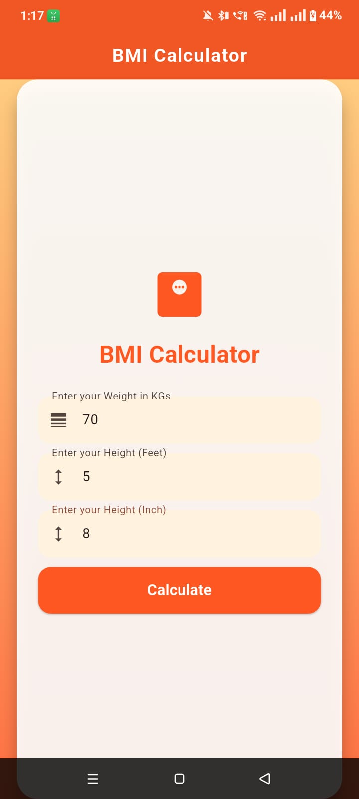

# BMI Calculator App (Flutter)

A simple BMI (Body Mass Index) Calculator application built using Flutter.  
The app calculates BMI based on user input (height and weight) and displays categorized results in a clean and user-friendly interface.

---

## Features

- Calculate BMI using height and weight
- Clean and simple UI design
- Separate result screen for output display
- BMI category classification (Underweight, Normal, Overweight, Obese)
- Easy navigation between screens

---

## Tech Stack

- Flutter
- Dart
- Material Design

---

## Screenshots

### Splash Screen

### Input Screen

### Result Screen

---

## Project Structure

lib/
├── main.dart
├── bmi_screen.dart
├── result_screen.dart

---

## Getting Started

### Prerequisites

- Flutter SDK installed
- Dart SDK configured
- Android Studio or VS Code

---

### Installation

Clone the repository:

git clone https://github.com/iqballakho07/BMI-Calculator.git

Navigate to the project directory:

cd BMI-Calculator

Install dependencies:

flutter pub get

Run the app:

flutter run

---

## Future Improvements

- Add animations for result screen
- Improve UI design with modern themes
- Add BMI history feature
- Add dark mode support

---

## Author

Name: Your Name  
GitHub: https://github.com/iqballakho07
